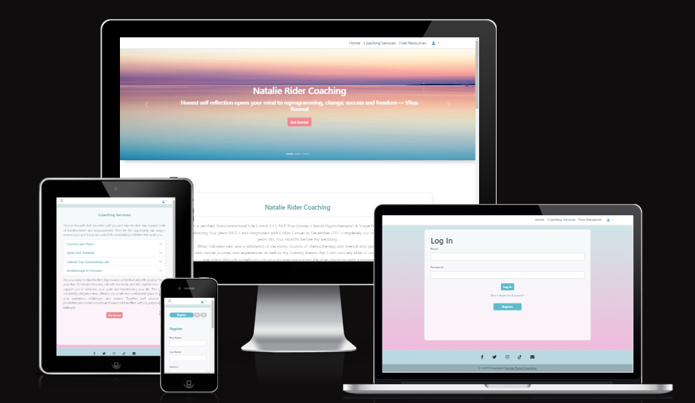
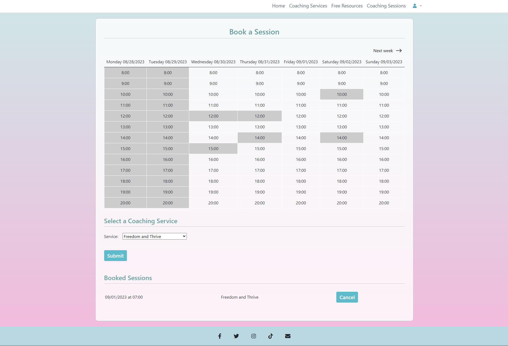
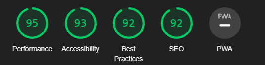

The life coach site is designed and dedicated to promoting mental health, balance and empowerment to female cancer patients by proposing the services of a life coach/therapist who will help them overcome the anxiety and trauma of cancer. The site is designed with a calming feminine esthetic and intuitive workflow to avoid overwhelming the cancer patient/user seeking the help they need. The patients can read through the resources and the different services made available to them by the therapist and then choose to register and book a session to start their mental recovery journey. The life coach on the other hand, being the admin, is able to see who and when a session is booked, as well as have the patients’ information at hand for various admin purposes. The admin has also control over their marketed image by publishing carefully selected testimonials onto their site from the admin panel. As of control, the patient is also equipped with CRUD functionality for their profile as well as flexible booking functionalities. Moreover, the site's visual hierarchy is well observed so contents are presented in relative importance to the patient. Since testimonials build trust, they are presented professionally too. The footer also integrates social media links for more effective marketing.

# Table of Contents
## Goals
* Target user and site owner
* Visual Design

## Features
* Page Elements
* Additional Features
* Features Not Yet Implemented
## Information Architecture
* Database Structure
* Data Models
## Technologies Used
* Languages
* Libraries
* Packages
* Platforms
* Other Tools
## Testing
* Automated Testing
* Manual Testing
* Bugs
* Accessibility
## Deployment
* Local Deployment
* Heroku Deployment
## Credit
* Code
* Content

# Goals
## User:
The site is designed for cancer patients seeking the help of a therapist to guide them through the emotional rollercoaster of cancer treatments. The goal is to help them navigate the site with ease to get to know what the therapist's approach, techniques and services are in order to book a session and sign up for a therapy treatment.

## Site owner:
The therapist/life coach needs a landing page with a custom design to inform the patients of the different techniques and services available to them to improve their life journey through these tough times. The admin part is meant to ease the process of patient management such as the sessions schedule and the admin information. The therapist specializing in cancer treatments, warns of the patient's sensitivity to overwhelming designs, bright colors and difficulty concentrating and thus wishes to use calming sunset/beach/nature themes, soothing pink and blue color palettes, simple feminine aesthetics and intuitive workflow.

## Visual Design:
A folder with further design elements can be accessed [here](https://drive.google.com/drive/folders/10s7BAd4owB5MGW1j-WFyv9pZy37bf08E?usp=sharing) as well as the [flowchart](https://drive.google.com/drive/folders/1BzyiPCHem474jnxKKmtgODtBxWiFTp0v?usp=sharing).
### Site Design:

This particular site is solely dedicated to women diagnosed with cancer and undergoing cancer treatment and thus the design has a feminine touch with calming pastel colors inspired by a sunset with pink and blue hues matching the wished-for palette. Intended as a healing meditative space that takes the anxiety of seeking yet another medical assistance away from the patient. The header also features a carousel with inspirational quotes to encourage cancer patients to seek help and regain their strength as well as set a meditative and empowering mood creating an emotional connection between the user and the coach. The site also features a divider image quoting self-care to remind the user that self-care is essential to surviving cancer. 

The site has a minimal aesthetic and color palette to avoid sensory overstimulation often as a result of chemotherapy as well as offers an intuitive workflow leading to booking a session and starting a journey of mental repair. Furthermore, as the site contains key information about the therapy packages, familiar colors, fonts, images, and other matching elements have been used throughout to reflect the site's organization as well as alert the patient to pay attention.

### Fonts:
The font family and style used are:

   * font-family: 'Open Sans'
   * Lead feature from Bootstrap
### Favicon:
A minimalistic favicon with the life coach's initials has been added giving the site a professional look. The favicon has been generated using [favicon.io](https://favicon.io/favicon-generator/).
# Features
## Page Elements:
The site contains various pages to introduce the user to the services and approaches this particular life coach/therapist offers. The following pages are accessible from the extendable navbar on top:
### Home page:

The first page welcomes the user into a simple and serene site of a life coach that offers different services and information to help female cancer patients. The site has a simple navbar that redirects the user to the Coaching Services, Free Resouces, Coaching Sessions, a dropdown menu for login/logout/register/Profile feature and back to the Home page. Once logged in or registered the navbar expands adding the coaching sessions section, where the user can book sessions with the therapist, and the profile section, where the user can edit or delete their account to protect their privacy. Furthermore, the home page is divided into 4 main sections:

    1. The hero section features as a background an image of a sunset with a gradient that sets the tone of the entire website, evoking a calm, relaxing and welcoming atmosphere, topped with text to showcase the coach's name/brand and inspirational quotes. 

    2. The About the Coach section features a personal introduction of the coach, who is also a cancer survivor and a certified therapist.
 
    3. The Coaching Services section is headed with a brief introduction of the coaching packages the coach offers including a button, get started, which prompts the user to register, and an account and eventually book a first free session with the coach using the booking calendar.
    
    4. The Testimonials section is displayed as a powerful marketing tool to build trust and inspire professionalism.
    
### Coaching services:
This part is featured twice on the site, once with brief information on the home page and again accessible from the navbar with more detailed information about the number of sessions, the duration, price and techniques used allowing the user to delve in and find the most suitable package. This section includes a button that will redirect the user to registering or logging in and then selecting a service and eventually booking a session at a suitable time and canceling it in case of a change of plan.

### Coaching resources:
This page is intended to simply give more information about the free resources available to them at the clinic and during the therapy sessions. As the goal is to inform, the esthetic is clean, minimal, light and familiar to help the user's brain focus and pay attention. 
 
### Coaching sessions:

This page is accessible from the navbar once registered or logged in as well as from the coaching sections and the home page. This section allows the user to select a service and then book a session with the coach with a handy calendar that shows which days and times are still available in white and the sessions that are not available greyed out as well as the sessions selected by that particular user in blue. Once the user selects an appropriate time and a service and submits it that session then appears in their personal list of sessions which in turn can be cancelled. To sum up, the user selects a service from the drop-down list then an available session on the calendar, clicks submit and that session will then appear as booked by them on the calendar in a light blue colour as well as on the my sessions section. The coach/admin will then personally review their schedule and the user’s profile information on the admin panel to contact the user if needed. 

### Accounts:

A site user has to register to book a session and edit their profile. The user can log in, log out and access their profile through the right end section of the navbar, login and drop-down menu list profile and logout. These account features have been implemented to give the necessary information to the admin/coach for billing purposes, client and time management. However, the account can also be deleted giving the user the right to privacy thus all CRUD functionalities have been implemented for better usability.

### Testimonials:
The ancient Greek philosopher, Pythagoras, postulated that the number 3 was considered the perfect number, the number of harmony, wisdom and understanding which is often used in hypnotherapy, neurolinguistics and the realm of psychology and thus the Testimonials section features only three testimonials to foster esthetic balance and harmony of the site and not overwhelm the user risking losing them as patients. The admin can update, delete, publish or choose to keep some testimonials saved as drafts for later. This site section is minimal, responsive and centered containing the author of the testimonial and the body of the testimonial. The therapist is then in control of the image they want to portray to other/future patients.

### Error Pages:
* 400 Error page appears when the server can not or will not process the request due to something that is perceived to be a client error 
* 403 Error page appears when the user does not have the necessary permissions to access the wanted page
* 404 Error page appears when the server can not find the page requested
* 500 Error page appears when the server encounters a problem, and can not complete a request

## Admin Page Elements
### Account management
The admin Panel contains three main sections:
### Custom User:
The patients that register are saved and displayed in the panel with the status of active or not and staff or not. The super user has then all the permissions and can also grant permissions to the users for example if another user such as an assistant can be permitted to maintain the site and manage the clients' sessions and accounts.

### User Profile
The custom user information section combined with the registration form displays the First Name, Last Name, Address, and Email address of the user that can be changed using the CRUD functionality available to the user on the home page

### Coaching Sessions Calendar and Display:
Displaying the user information, the time and date of the session chosen by the user. These sessions can be canceled by the user, from the site once logged in, if they choose to.

### Testimonials:
Displaying the name, body and status of the testimonials published will publish them on the site and draft status will save them. The testimonials are solely managed by and through the admin panel.

## Features Not Yet Implemented
### Post Content:
The admin ability to post articles, meditation guides, journals and workbooks. 

# Information Architecture
## Database:

ElephantSQL is hosted by PostgreSQL has been used as a database.

## Data Models:

* Custom User: CustomUser() has been created and migrated to create a user account to access the booking system to book a session with the coach and manage the bookings.
* Testimonials: Testimonial() has been created and migrated to publish testimonials from the admin panel as a marketing tool
* Booking: CoachingSession() has been created and migrated to book a session with the coach as well as manage booked sessions such as canceling a session.

# Technologies Used
## Languages:

* Logic:
    - Python

* Template:
    - HTML
    - CSS
    - Javascript

* Database:
    - Structured Query Language

## Libraries:
    1. dj_database_url==0.5.0 psycopg2
    2. os library
    3. Cloudinary

## Tools:
Code validation was done using the following tools:

| **Tools**     | **Language**   |**Validation Result** |
| -----         | ----------     | -----------------    |
| W3C           | HTML           | Valid                |
| CSS Portal    | CSS            | Valid                |
| esprima.org   | Javascript     | Valid                |
| PEP8          | Python         | Valid                |

Responsiveness has been tested using:

  * [BrowserStack](https://www.browserstack.com/)
  * Screenshots of responsiveness have been added to this drive [file](https://www.browserstack.com/).

# Testing
Testing was conducted automatically as well as manually. Automatic testing was used for backend functions, with an easily testable input-output relationship. Manual testing was added to account for interactive scenarios, that are not easily testable with automation. 

## Automated Testing:
### Why use Automated Unit Testing?
Automated testing was used to efficiently test the core functionality, such as database object creation as well as middleware functionality with a clear input-output relationship. These test cases can then be repeated during the development process, to ensure continuous functionality, thus eliminating human error.

### The features tested with automated unit testing are:
    Database object creation:
        - User
        - Super-user
        - Session
        - Testimonial

    Middleware:
        - Calendar date and session processing functions, which are vital for the correct visualization of the calendar

The result of the automated testing is as follows:

Debug mode is on.
Creating test database for alias 'default'...
System check identified no issues (0 silenced).
normal@user.de | service: Freedom and Thrive
..Test super user
create_superuser
..Test normal user
.
----------------------------------------------------------------------
Ran 5 tests in 0.481s

OK
Destroying test database for alias 'default'...
##  Manual Testing:
A detailed Manual Test Protocol has been created to document the steps taken for testing including responsiveness, Please, see the document for further details. The Manual Test Protocol is accessible through this [drive link](https://drive.google.com/drive/folders/1L4WP4BcJh_ixJev1f9W-9LHCpFTmigTt?usp=sharing)
### Why Use Manual Testing?
Manual testing was conducted for scenarios, that can not easily be tested via automation and thus involve a system-level interaction across several components. Regardless, the manual tests are written in a strictly repeatable manner, to ensure consistency across testers and time.

### The features tested manually are:

1. User registration: Test if the can user enter the required information such as name, email address, password, and address and subsequently register. Test error messages are displayed to the user. 
2. Account management: Test if the user can edit their profile information and view their newly edited saved profile. Test profile deletion and robustness to incorrect entries.
3. Accessibility: Test if the website's features and functions are accessible to users with disabilities, such as screen readers or keyboard-only users.
4. Booking process: Test booking page navigation and session booking, as well as session cancelation.

## Accessibility

  * The overall performance of the site has been tested on desktop and mobile using Lighthouse and the site has passed the accessibility test
## Bugs:
1) Issue:       The user was able to book a session in the past.
   Resolution:  The user is now prevented from booking past sessions, by disabling the possible user interaction for the present day and all previous days.

2) Issue:       Regardless of the error, the user always received the same "Passwords do not match" error when making a mistake in the registration form.
   Resolution:  A custom routine was added to the user registration routines to extract the exact error from the available information.

3) Issue:       Although for the current week, no "Previous week" button is shown, the user was able to manipulate the URL parameters manually to change the calendar to any previous week.
   Resolution:  Negative URL parameters for the week offset are now blocked.

## Deployment

* Local Deployment

    1. Install Django and supporting libraries mentioned above, create a requirements file, a project and an app, and save, migrate and run the server using the command "python3 manage.py runserver".

* Heroku Deployment:

    1. Create an external database: Create an ElephantSQL account and instance then set up the plan and the instance as instructed and finally add the ElephantSQL database URL to Heroku.
    2. Create the Heroku app: Create the app, add the Config Vars then attach the database.
    3. Prepare the environment and settings.py file: Create a new env.py file, import the Os library, set environment variables including the secret key, add the links to the DATATBASE_URL variable on Heroku and finally add Heroku Hostname to ALLOWED_HOSTS and deploy through Heroku.

## Credit
* The code has been created following the Django and Bootstrap official documentation as well as the courses provided by the Code Institute. 
* Testing code used in test_create_user() and test_create_superuser() have been done following the guide "Create a Custom User Model in Django" by Michael Herman published in [testdriven. io](https://testdriven.io/blog/django-custom-user-model/ 
    #settings).
* The RegisterUserForm() has been adapted from courses taken on [Codemy.com](https://codemy.com/).

## Content

The content of the Website has been used and developed with the consent of a certified Life Coach whose name has been changed for privacy reasons. The content can be seen [here](https://drive.google.com/drive/folders/1_awslZHQsQfMlFC5cb1gW_YfR_6Asccn?usp=sharing).

